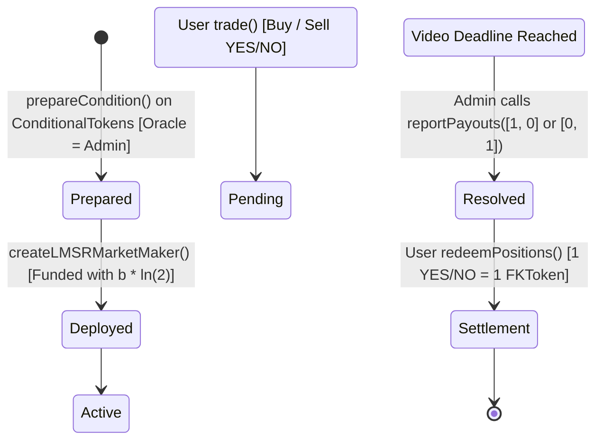
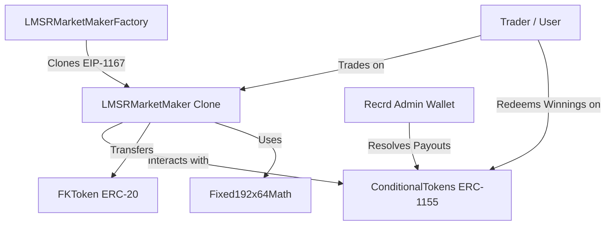

# Recrd LMSR Prediction Market: Complete Technical Architecture Blueprint

---

## Table of Contents
- [Recrd LMSR Prediction Market: Complete Technical Architecture Blueprint](#recrd-lmsr-prediction-market-complete-technical-architecture-blueprint)
  - [Table of Contents](#table-of-contents)
  - [1. Executive Summary \& System Scope](#1-executive-summary--system-scope)
  - [2. Phase 1 — Requirement Analysis](#2-phase-1--requirement-analysis)
    - [1.1 Functional Requirements](#11-functional-requirements)
    - [1.2 Non-Functional Requirements](#12-non-functional-requirements)
    - [1.3 Protocol Assumptions \& Business Rules](#13-protocol-assumptions--business-rules)
    - [1.4 Actor Profiles \& Access Matrix](#14-actor-profiles--access-matrix)
    - [1.5 Market State Machine \& Transitions](#15-market-state-machine--transitions)
    - [1.6 Edge Cases, Failure Scenarios \& Security Assumptions](#16-edge-cases-failure-scenarios--security-assumptions)
  - [3. Phase 2 — System Architecture](#3-phase-2--system-architecture)
    - [2.1 High-Level Protocol Architecture](#21-high-level-protocol-architecture)
    - [2.2 Smart Contract Architecture \& Dependency Graph](#22-smart-contract-architecture--dependency-graph)
    - [2.3 Module Responsibilities](#23-module-responsibilities)
    - [2.4 Storage \& Data Flow Architecture](#24-storage--data-flow-architecture)
    - [2.5 Contract Ownership \& Permission Model](#25-contract-ownership--permission-model)
  - [4. Phase 3 — Contract Breakdown](#4-phase-3--contract-breakdown)
    - [3.1 FKToken.sol (ERC-20 Collateral)](#31-fktokensol-erc-20-collateral)
    - [3.2 ConditionalTokens.sol (ERC-1155 Global Ledger)](#32-conditionaltokenssol-erc-1155-global-ledger)
    - [3.3 LMSRMarketMakerFactory.sol (EIP-1167 Proxy Factory)](#33-lmsrmarketmakerfactorysol-eip-1167-proxy-factory)
    - [3.4 LMSRMarketMaker.sol (AMM Liquidity Pool)](#34-lmsrmarketmakersol-amm-liquidity-pool)
    - [3.5 Direct Admin Wallet (Oracle Role)](#35-direct-admin-wallet-oracle-role)
  - [5. Phase 4 — Complete Execution Flow \& Call Chains](#5-phase-4--complete-execution-flow--call-chains)
    - [4.1 Market \& Admin Question Initialization](#41-market--admin-question-initialization)
    - [4.2 Pool Deployment \& Seeding (LMSR Initialization)](#42-pool-deployment--seeding-lmsr-initialization)
    - [4.3 User Buying Outcome Shares (Buy Trade)](#43-user-buying-outcome-shares-buy-trade)
    - [4.4 User Selling Outcome Shares (Sell Trade)](#44-user-selling-outcome-shares-sell-trade)
    - [4.5 Admin Outcome Resolution \& Settlement](#45-admin-outcome-resolution--settlement)
  - [6. Phase 5 — Contract Integration Map](#6-phase-5--contract-integration-map)
  - [7. Phase 6 — Mathematical Model \& Fixed-Point Arithmetic](#7-phase-6--mathematical-model--fixed-point-arithmetic)
    - [6.1 Cost Function \& Pricing Equations](#61-cost-function--pricing-equations)
    - [6.2 Bounded Loss](#62-bounded-loss)
  - [8. Phase 7 — Storage Design \& Security Review](#8-phase-7--storage-design--security-review)
  - [9. Phase 8 — Security \& Roadmap](#9-phase-8--security--roadmap)

---

## 1. Executive Summary & System Scope

The **Recrd Prediction Market Protocol** is a decentralized prediction market platform built on top of the **Conditional Tokens Framework (CTF)** (ERC-1155) combined with an **LMSR (Logarithmic Market Scoring Rule)** Automated Market Maker (AMM).

In the Recrd ecosystem, prediction markets are automatically generated for user-uploaded videos (e.g., *"Will Video #123 reach 100,000 views in 7 days?"*). The LMSR AMM provides **guaranteed, continuous, algorithmic liquidity** for all markets. Outcome resolution is managed directly by the **Recrd Admin** (via an Admin Oracle), eliminating external third-party oracle dependencies.

This document serves as the authoritative, end-to-end technical blueprint for the architecture, smart contract design, execution flows, mathematical models, storage layouts, security parameters, and deployment roadmap.

---

## 2. Phase 1 — Requirement Analysis

### 1.1 Functional Requirements
1. **Collateral Management:**
   - The protocol MUST support `FKToken` (a standard ERC-20 token) as the sole collateral currency for pool funding, user bets, fee collection, and payout redemptions.
2. **Global Outcome Accounting:**
   - All outcome shares MUST be minted, tracked, and burned as ERC-1155 tokens via a single `ConditionalTokens` global ledger contract.
3. **Dynamic Algorithmic Market Making:**
   - Each video market MUST have an isolated `LMSRMarketMaker` contract deployed via an EIP-1167 Minimal Proxy factory.
   - The AMM MUST continuously price binary outcomes (YES / NO) based on outcome net liabilities ($q_{yes}, q_{no}$) and the liquidity parameter $b$.
4. **Bidirectional Trading (Buy & Sell):**
   - Users MUST be able to buy YES or NO shares by paying `FKToken`.
   - Users MUST be able to sell YES or NO shares back to the AMM pool before market resolution, receiving `FKToken` in return based on the negative LMSR cost difference.
5. **Slippage & Limit Protection:**
   - Every trade execution MUST accept a `collateralLimit` parameter to protect users against price front-running and excess slippage.
6. **Direct Admin Resolution:**
   - Outcomes MUST be resolved exclusively by the Recrd Admin / Operator via direct `reportPayouts` call on `ConditionalTokens`.
   - Outcome resolution MUST trigger automated payout vector reporting (`[1, 0]` for YES or `[0, 1]` for NO) on `ConditionalTokens`.
7. **Settlement & Redemption:**
   - Upon market resolution, winning token holders MUST be able to burn their ERC-1155 outcome tokens and redeem `FKToken` collateral at a 1:1 payout ratio.
8. **Trading Fee Collection:**
   - The AMM MUST support configurable trading fee percentages (e.g., 2%), which accumulate within the pool to compensate the Liquidity Provider (LP).

### 1.2 Non-Functional Requirements
1. **Gas Efficiency:**
   - Contract deployment MUST use EIP-1167 Minimal Proxy clones (`LMSRMarketMakerFactory`) to reduce deployment gas costs from ~2,500,000 gas to ~50,000 gas per video market.
2. **Fixed-Point Precision:**
   - Mathematical calculations MUST use 192.64 fixed-point math (`Fixed192x64Math`) to prevent rounding errors, overflow, or underflow during exponential and natural logarithmic computations.
3. **Deterministic Token Identifiers:**
   - ERC-1155 token IDs MUST be deterministically computable from `collateralToken`, `conditionId`, and `indexSet`.
4. **Target Blockchain Compatibility:**
   - The protocol contracts MUST deploy seamlessly on Polygon Amoy Testnet (Chain ID `80002`) and Ethereum mainnet/EVM equivalents using Solidity `0.8.20+`.

### 1.3 Protocol Assumptions & Business Rules
1. **Binary Outcome Scope:**
   - Each LMSR market in the Recrd video ecosystem is binary ($N = 2$: Index 0 = YES, Index 1 = NO).
2. **Max Loss Cap:**
   - The maximum financial exposure for the LP in an LMSR pool with parameter $b$ is strictly bounded by $b \times \ln(2)$.
3. **Symmetric Initial State:**
   - Initial pool deployment seeds equal amounts of YES and NO tokens ($q_{yes} = 0, q_{no} = 0$), setting the starting marginal price of YES and NO to exactly $0.50$ (50%).
4. **Non-Expiring Collateral Escrow:**
   - `FKToken` collateral deposited into `ConditionalTokens` during minting (`splitPosition`) is safely held in escrow until redeemed by winning users or merged by the pool.

### 1.4 Actor Profiles & Access Matrix

| Actor | Description | Privileges & Actions |
|-------|-------------|----------------------|
| **Recrd Admin / Operator** | Platform administrator wallet / multisig | - Deploys factory & base contracts<br>- Resolves market outcomes (`reportPayouts`) directly<br>- Sets factory fee recipient |
| **Liquidity Provider (Recrd LP)** | Backend service funding video markets | - Calls `LMSRMarketMakerFactory.createLMSRMarketMaker()` to seed market liquidity ($b$ parameter) |
| **Trader (Alice / Bob)** | End-user predicting video performance | - Calls `LMSRMarketMaker.trade()` to buy/sell YES/NO shares<br>- Calls `ConditionalTokens.redeemPositions()` to claim winnings |

### 1.5 Market State Machine & Transitions



### 1.6 Edge Cases, Failure Scenarios & Security Assumptions

1. **Extreme One-Sided Buying (YES Price -> 1.0):**
   - *Scenario:* All users buy YES; $q_{yes} \gg q_{no}$.
   - *Behavior:* Price of YES asymptotically approaches 1.0. Marginal cost of YES reaches 1.0 FKToken. Traders stop buying because potential profit is 0. AMM pool loss hits its exact theoretical bound of $b \cdot \ln(2)$ and stops increasing.
2. **Insufficient Collateral on Pool Sell:**
   - *Scenario:* User sells a large batch of YES tokens back to the pool when pool raw `FKToken` balance is lower than the required payout.
   - *Behavior:* The `LMSRMarketMaker` contract automatically calls `ConditionalTokens.mergePositions()`, burning equal pairs of YES and NO tokens in its inventory to unlock underlying `FKToken` collateral from global escrow before executing the payout transfer to the user.
3. **Voided / Refund Market:**
   - *Scenario:* Video is deleted or system error occurs.
   - *Behavior:* Admin reports equal payout vector `[1, 1]` (or 50/50 split). Both YES and NO token holders can redeem their tokens for 0.50 FKToken each, refunding all participants fairly.
4. **Front-Running & Sandwich Attacks:**
   - *Scenario:* MEV bot front-runs user's `trade()` call to push price higher.
   - *Behavior:* The user's trade reverts immediately because the actual cost exceeds the specified `collateralLimit`.

---

## 3. Phase 2 — System Architecture

### 2.1 High-Level Protocol Architecture

```text
 ┌─────────────────────────────────────────────────────────────────────────────────┐
 │                            RECRD PREDICTION MARKET                              │
 └─────────────────────────────────────────────────────────────────────────────────┘
                                           │
                                           ▼
                       ┌───────────────────────────────────────┐
                       │        Video Prediction Market        │
                       │     (100% Algorithmic LMSR AMM)       │
                       └───────────────────────────────────────┘
                                           │
                                           ▼
                       ┌───────────────────────────────────────┐
                       │      LMSRMarketMaker (Proxy Pool)     │
                       │     (Automated Price & Liquidity)     │
                       └───────────────────────────────────────┘
                                           │
                                           ▼
                       ┌───────────────────────────────────────┐
                       │     ConditionalTokens (ERC-1155)      │
                       │    Global Accounting & Escrow Engine  │
                       └───────────────────────────────────────┘
                                           ▲
                                           │ Direct Admin Resolution
                       ┌───────────────────┴───────────────────┐
                       │              AdminOracle              │
                       │       (Recrd Admin Multisig)          │
                       └───────────────────────────────────────┘
```

### 2.2 Smart Contract Architecture & Dependency Graph



### 2.3 Module Responsibilities

1. **`FKToken.sol`:**
   - ERC-20 compliant mintable/burnable collateral token representing platform currency.
2. **`ConditionalTokens.sol`:**
   - Implements ERC-1155 multi-token standard for outcome positions.
   - Manages condition preparation (`prepareCondition`), position splitting (`splitPosition`), position merging (`mergePositions`), and payout redemption (`redeemPositions`).
   - Acts as locked escrow for all underlying `FKToken` backing outcome tokens.
3. **`LMSRMarketMakerFactory.sol`:**
   - Deploys `LMSRMarketMaker` instances using EIP-1167 proxy clones.
   - Tracks deployed market registries and global trading fee configurations.
4. **`LMSRMarketMaker.sol`:**
   - Isolated market maker for a specific video condition.
   - Executes logarithmic cost calculations, handles buy/sell transactions, manages inventory, and enforces slippage limits.
5. **Recrd Admin Wallet (Oracle):**
   - Address designated as the `oracle` in `ConditionalTokens.prepareCondition()`. It holds exclusive permissions to call `reportPayouts` to conclude the market outcomes directly.

### 2.4 Storage & Data Flow Architecture

```text
[User] ──(1) FKToken.approve(LMSRPool)──> [FKToken Contract]
  │
  ├──(2) LMSRPool.trade([+500, 0], limit)──> [LMSRMarketMaker Pool]
                                                  │
                                                  ├──(3) calcNetCost() via Fixed192x64Math
                                                  │
                                                  ├──(4) FKToken.transferFrom(User -> Pool)
                                                  │
                                                  ├──(5) FKToken.approve(ConditionalTokens)
                                                  │
                                                  ├──(6) ConditionalTokens.splitPosition()
                                                  │         │
                                                  │         └──> Mint ERC-1155 YES/NO to Pool
                                                  │
                                                  └──(7) ERC-1155.safeTransferFrom(Pool -> User)
                                                            (Delivers 500 YES to User)
```

### 2.5 Contract Ownership & Permission Model
- **`LMSRMarketMakerFactory`:** Owned by Recrd Governance Multisig. Can update fee recipient.
- **`LMSRMarketMaker`:** Immutable clone after initialization. Operates autonomously; has no admin backdoors that allow draining collateral.
- **Recrd Admin:** The Oracle role on `ConditionalTokens` is a designated EOA wallet address or Gnosis Safe multisig controlled by Recrd.

---

## 4. Phase 3 — Contract Breakdown

### 3.1 FKToken.sol (ERC-20 Collateral)
- **Purpose:** Platform collateral token.
- **State Variables:** Standard ERC-20 balances, allowances, total supply, `owner`.
- **Functions:**
  - `mint(address to, uint256 amount)`: Admin faucet/mint function for collateral seeding.
  - `burn(uint256 amount)`: Burn collateral tokens.

### 3.2 ConditionalTokens.sol (ERC-1155 Global Ledger)
- **Purpose:** Multi-token accounting system for conditional claims.
- **State Variables:**
  - `mapping(bytes32 => uint256[]) public payoutNumerators`: Payout ratios per `conditionId`.
  - `mapping(bytes32 => uint256) public payoutDenominator`: Total payout denominator per `conditionId`.
- **Key Functions:**
  - `prepareCondition(address oracle, bytes32 questionId, uint256 outcomeSlotCount)`: Creates a new condition slot.
  - `splitPosition(IERC20 collateralToken, bytes32 parentCollectionId, bytes32 conditionId, uint256[] partition, uint256 amount)`: Takes collateral, mints outcome tokens.
  - `mergePositions(IERC20 collateralToken, bytes32 parentCollectionId, bytes32 conditionId, uint256[] partition, uint256 amount)`: Burns outcome tokens, releases collateral.
  - `redeemPositions(IERC20 collateralToken, bytes32 parentCollectionId, bytes32 conditionId, uint256[] indexSets)`: Burns winning outcome tokens post-resolution and releases 1:1 collateral.

### 3.3 LMSRMarketMakerFactory.sol (EIP-1167 Proxy Factory)
- **Purpose:** Factory for deploying isolated LMSR market clones.
- **State Variables:**
  - `address public implementationMaster`: Master `LMSRMarketMaker` logic contract.
  - `address public feeRecipient`: Address receiving protocol trading fees.
- **Key Functions:**
  - `createLMSRMarketMaker(ConditionalTokens pmSystem, IERC20 collateralToken, bytes32[] conditionIds, uint64 fee, address whitelist, uint256 funding)`: Clones master implementation, pulls `funding` collateral, calls `initialize()`.

### 3.4 LMSRMarketMaker.sol (AMM Liquidity Pool & Staking Vault)
- **Purpose:** Algorithmic liquidity provider, pricing engine, and user-delegated staking vault.
- **State Variables:**
  - `ConditionalTokens public pmSystem`: Reference to global ERC-1155 contract.
  - `IERC20 public collateralToken`: Reference to `FKToken`.
  - `bytes32[] public conditionIds`: Array containing market condition ID.
  - `uint256 public atomicOutcomeSlotCount`: Number of outcomes (2 for binary).
  - `uint64 public fee`: Fee fraction (e.g., 2 * 10^16 for 2%).
  - `int256[] public netOutcomeTokensSold`: Array tracking net liabilities ($q_{yes}, q_{no}$).
  - `uint256 public totalLPTokenSupply`: Total supply of LP tokens representing stakes.
  - `mapping(address => uint256) public lpTokenBalanceOf`: LP token ledger of stakers.
  - `uint256 public activeTradingLiquidity`: Collateral currently utilized in LMSR active reserves.
  - `uint256 public poolFeeCollected`: Accumulated transaction fees.
  - `uint64 public lpRewardRatio`: Percentage of fees distributed to LPs vs. protocol.
- **Key Functions:**
  - `initialize(...)`: Sets clone parameters and mints initial inventory ($b$).
  - `trade(int256[] outcomeTokenAmounts, int256 collateralLimit)`: Executes buy/sell trade.
  - `calcNetCost(int256[] outcomeTokenAmounts) public view returns (int256 netCost)`: Calculates cost difference.
  - `calcMarginalPrice(uint8 outcomeIndex) public view returns (uint256 price)`: Returns spot price.
  - `depositLiquidity(uint256 collateralAmount)`: Pulls collateral from staker, mints LP tokens 1:1, and instantly auto-allocates collateral into active trading reserves (expanding $b$ depth immediately and splitting positions on ConditionalTokens).
  - `withdrawLiquidity(uint256 lpTokenAmount)`: Burns LP tokens, merges inventory positions on ConditionalTokens to release collateral, and returns collateral + share of collected fee rewards.
  - `setFeeRewardDistribution(uint64 ratio)`: Admin-only. Configures fee sharing ratio.

### 3.5 Direct Admin Wallet (Oracle Role)
- **Purpose:** Directly calls `ConditionalTokens` to initialize markets and conclude outcomes, avoiding contract proxy overhead.
- **Responsibilities:**
  - Prepares conditions directly on `ConditionalTokens` by calling `prepareCondition()`, specifying the Admin's address as the authorized `oracle`.
  - Reports final payout vectors (`[1, 0]` or `[0, 1]`) to `ConditionalTokens` using the `reportPayouts` function.

---

## 5. Phase 4 — Complete Execution Flow & Call Chains

### 4.1 Market & Admin Question Initialization
1. Recrd Admin Wallet calls `ConditionalTokens.prepareCondition(adminAddress, questionId, 2)`.

2. `ConditionalTokens` computes `conditionId = keccak256(abi.encodePacked(adminAddress, questionId, 2))`.
3. Storage Update: `ConditionalTokens.payoutNumerators[conditionId]` initialized with length 2.

### 4.2 Pool Deployment & Seeding (LMSR Initialization)
1. Recrd Backend approves `LMSRMarketMakerFactory` for `1000 FKToken`.
2. Backend calls `factory.createLMSRMarketMaker(pmSystem, FKToken, [conditionId], fee, 0x0, 1000 * 10^18)`.
3. Factory clones implementation using `Clones.clone()`.
4. Factory calls `LMSRMarketMaker.initialize(...)`.
5. Pool transfers `1000 FKToken` from Backend to itself.
6. Pool approves `ConditionalTokens` and calls `pmSystem.splitPosition(FKToken, 0x0, conditionId, [1, 2], 1000 * 10^18)`.
7. `ConditionalTokens` transfers `1000 FKToken` to escrow, mints `1000 YES` and `1000 NO` to Pool.

### 4.3 User Buying Outcome Shares (Buy Trade)
1. Alice calls `FKToken.approve(address(pool), 400 * 10^18)`.
2. Alice calls `pool.trade([500 * 10^18, 0], 400 * 10^18)`.
3. `pool.trade()` calls internal `calcNetCost([500 * 10^18, 0])` -> `netCost = 280.93 FKToken`.
4. Pool transfers `280.93 FKToken` from Alice to Pool.
5. Pool calls `splitPosition(FKToken, 0x0, conditionId, [1, 2], 280.93 * 10^18)` on `ConditionalTokens`.
6. Pool transfers `500 YES` to Alice.

### 4.4 User Selling Outcome Shares (Sell Trade)
1. Alice calls `ConditionalTokens.setApprovalForAll(address(pool), true)`.
2. Alice calls `pool.trade([-200 * 10^18, 0], 150 * 10^18)`.
3. `pool.trade()` calls internal `calcNetCost([-200 * 10^18, 0])` -> negative cost `-155 FKToken`.
4. Alice transfers `200 YES` to Pool.
5. Pool calls `ConditionalTokens.mergePositions()` to burn matching pairs and unlock `200 FKToken` from escrow if needed.
6. Pool transfers `155 FKToken` to Alice.

### 4.5 Admin Outcome Resolution & Settlement
1. Video deadline hits (e.g., hit 1M views = YES).
2. Recrd Admin calls `ConditionalTokens.reportPayouts(questionId, [1, 0])` directly.
3. Alice calls `ConditionalTokens.redeemPositions(FKToken, 0x0, conditionId, [1])`.
4. `ConditionalTokens` burns Alice's YES tokens and transfers `FKToken` collateral 1:1 to Alice.

### 4.6 User Delegated Liquidity Provision & Reward Distribution Flow
1. Bob (Staker) approves `LMSRMarketMaker` to spend `1000 FKToken`.
2. Bob calls `LMSRMarketMaker.depositLiquidity(1000 * 10^18)`.
3. `LMSRMarketMaker` transfers `1000 FKToken` from Bob to the contract, mints `1000 LP` tokens to Bob, and **instantly auto-allocates** the `1000 FKToken` to active trading reserves (increasing $b$ parameter depth and splitting positions on `ConditionalTokens` immediately).
4. As trades occur, a fee (e.g., 2%) is collected and added to `poolFeeCollected`.
5. Recrd Admin sets LP share: `LMSRMarketMaker.setFeeRewardDistribution(80 * 10^16)` (80% fee rewards to LPs, 20% to protocol).
6. Bob calls `LMSRMarketMaker.withdrawLiquidity(1000 * 10^18)`.
7. `LMSRMarketMaker` calculates Bob's share of `poolFeeCollected`, merges inventory on `ConditionalTokens` to release escrowed collateral, burns `1000 LP` tokens, and transfers his principal + fee rewards to Bob.

---

## 6. Phase 5 — Contract Integration Map

```text
[Recrd Admin Wallet]
       │
       ├──(1) prepareCondition(adminAddress, questionId, 2) ──> [ConditionalTokens]
       │                                                             │
       │                                                             └── [Storage Update: payoutNumerators]
       │
       ├──(3) createLMSRMarketMaker() ──> [LMSRMarketMakerFactory]
                                                 │
                                                 ├──(4) Clone Proxy ──> [LMSRMarketMaker Pool]
                                                 │                             │
                                                 │                             └──(5) splitPosition() ──> [ConditionalTokens]
[Trader Alice]                                   │                                                             │
       │                                         │                                                             └── [Escrow FKToken]
       ├──(6) trade([+500, 0]) ──────────────────┘
       │          │
       │          ├──(7) transferFrom(Alice -> Pool) ──> [FKToken]
       │          ├──(8) splitPosition() ──────────────> [ConditionalTokens]
       │          └──(9) safeTransferFrom(Pool -> Alice) [ERC-1155 YES Tokens]
       │
[Recrd Admin Wallet]
       │
       └──(10) reportPayouts(questionId, [1, 0]) ──> [ConditionalTokens]
                                                                                            │
[Trader Alice]                                                                              │
       │                                                                                    │
       └──(12) redeemPositions() ───────────────────────────────────────────────────────────┘
                  │
                  └──(13) Burn YES & Transfer Escrow FKToken ──> [Alice Wallet]
```

---

## 7. Phase 6 — Mathematical Model & Fixed-Point Arithmetic

### 6.1 Cost Function & Pricing Equations
$$C(q) = b \cdot \ln \left( \exp\left(\frac{q_{yes}}{b}\right) + \exp\left(\frac{q_{no}}{b}\right) \right)$$

$$P(\text{YES}) = \frac{\exp\left(\frac{q_{yes}}{b}\right)}{\exp\left(\frac{q_{yes}}{b}\right) + \exp\left(\frac{q_{no}}{b}\right)}$$

### 6.2 Bounded Loss
$$\text{Max Loss} = b \cdot \ln(2) \approx 0.693147 \cdot b$$

---

## 8. Phase 7 — Storage Design & Security Review

- **Packing:** Owner (`address`), Initialized (`bool`), and Fee (`uint64`) packed into Slot 0.
- **Security:** ReentrancyGuard on `trade()`, slippage limits enforced via `collateralLimit`, direct Admin control over payout resolution.

---

## 9. Phase 8 — Security & Roadmap

- **Milestone 1:** `FKToken.sol`, `ConditionalTokens.sol`, `Fixed192x64Math.sol`.
- **Milestone 2:** `LMSRMarketMaker.sol`, `LMSRMarketMakerFactory.sol`.
- **Milestone 3:** Direct Integration & Admin Scripts (no adapter contract needed).
- **Milestone 4:** Sepolia Deployment & E2E Verification.

---
