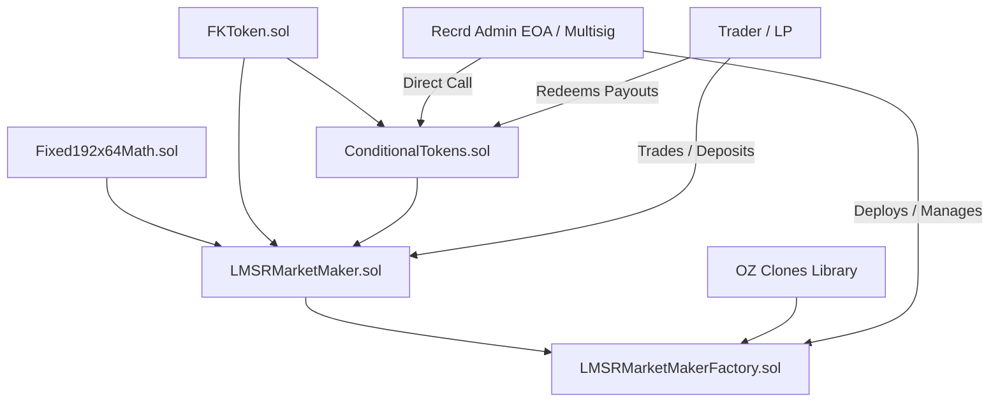
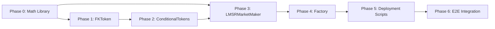
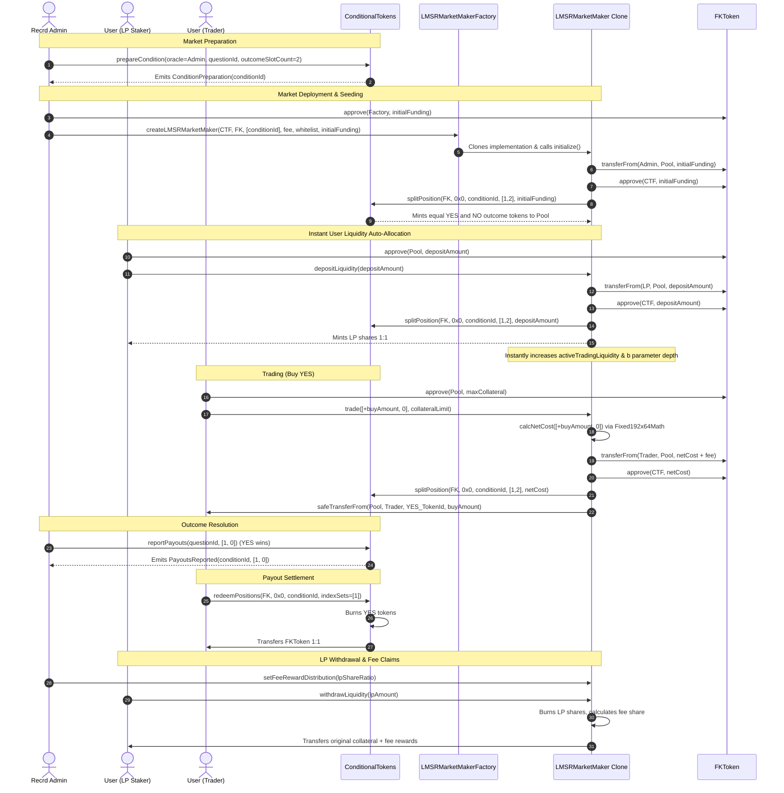

# Recrd LMSR Prediction Market: Technical Execution Blueprint (`EXECUTION.md`)

---

## 1. Executive Purpose & Blueprint Scope

This document serves as the **authoritative, sequential implementation roadmap** for building the **Recrd LMSR Prediction Market Protocol** from scratch. 

The blueprint translates the architecture specification ([ARCHITECTURE.md](file:///home/sparkout/Record-Project-Preapation/ARCHITECTURE.md)) into an unambiguous, step-by-step developer guide. It is structured into strict sequential phases based on contract dependency graphs. No component is built before its prerequisites are fully tested and verified.

---

## 2. High-Level Implementation Timeline & Roadmap

| Phase | Target Deliverable | Description | Primary Dependencies |
| :--- | :--- | :--- | :--- |
| **Phase 0** | Workspace & `Fixed192x64Math.sol` | Setup Foundry environment & implement 192.64 fixed-point math library | None |
| **Phase 1** | `FKToken.sol` | Implement upgradeable ERC-20 collateral token with permit and pausable controls | OpenZeppelin Upgradeable |
| **Phase 2** | `ConditionalTokens.sol` | Implement ERC-1155 global outcome accounting engine and position split/merge/redeem logic | OpenZeppelin ERC1155, `FKToken` |
| **Phase 3** | `LMSRMarketMaker.sol` | Implement LMSR pricing engine, trade execution, and user-delegated staking vault | `Fixed192x64Math`, `ConditionalTokens`, `FKToken` |
| **Phase 4** | `LMSRMarketMakerFactory.sol` | Implement EIP-1167 proxy clone factory for isolated market deployment | `LMSRMarketMaker`, OpenZeppelin Clones |
| **Phase 5** | Deployment & Verification Scripts | Build Foundry deployment scripts for Sepolia & Polygon Amoy testnets | Phase 0 - Phase 4 |
| **Phase 6** | E2E Testing & Verification | Comprehensive integration testing, edge-case simulation, and verification | All Smart Contracts |

---

## 3. Architecture & Dependency Diagrams

### 3.1 Smart Contract Dependency Graph



### 3.2 Phase Execution Dependency Graph



### 3.3 End-to-End Execution Sequence Flow



---

## 4. Sequential Phase-by-Phase Execution Plan

---

### Phase 0: Development Environment & Fixed-Point Mathematics (`Fixed192x64Math.sol`)

#### 1. Objective
Establish the project workspace configuration (Foundry/Remappings) and implement the exact 192.64 fixed-point arithmetic library (`Fixed192x64Math.sol`) required for log and exponential LMSR cost functions on-chain.

#### 2. Dependency Rationale
LMSR price scoring relies on exponential ($\exp$) and natural logarithm ($\ln$) functions. Standard Solidity integer division truncates precision, causing catastrophic rounding errors and broken AMM cost curves. The math library MUST be implemented and 100% unit-tested before building any market maker logic.

#### 3. Components to Implement
- Workspace file structure: `foundry.toml`, `remappings.txt`.
- Library contract: `Recrd/libraries/Fixed192x64Math.sol`.

#### 4. Storage Variables
None (Pure Library).

#### 5. Interfaces & Dependencies Required
None. Uses standard inline assembly and bitwise shifts.

#### 6. Functions to Implement (Implementation Order)
1. `fromUint(uint256 x) internal pure returns (int256)`: Converts integer to 192.64 fixed point by bit-shifting left by 64 bits (`x << 64`).
2. `toUint(int256 x) internal pure returns (uint256)`: Converts 192.64 fixed point back to integer by bit-shifting right by 64 bits (`x >> 64`).
3. `binaryLog(int256 x) internal pure returns (int256)`: Calculates $\log_2(x)$ using binary approximation loop.
4. `ln(int256 x) internal pure returns (int256)`: Calculates natural logarithm $\ln(x) = \log_2(x) \times \ln(2)$.
5. `pow2(int256 x) internal pure returns (int256)`: Calculates $2^x$ using integer power and fractional polynomial approximation.
6. `exp(int256 x) internal pure returns (int256)`: Calculates $e^x = 2^{x / \ln(2)}$.

#### 7. Internal Helper Functions Required
- `mul(int256 a, int256 b) internal pure returns (int256)`: Fixed-point multiplication `(a * b) >> 64`.
- `div(int256 a, int256 b) internal pure returns (int256)`: Fixed-point division `(a << 64) / b`.

#### 8. Events, Modifiers, Errors, and Structs
- Custom Errors:
  - `FixedPointOverflow()`
  - `FixedPointUnderflow()`
  - `InvalidLogArgument()`

#### 9. External Contract Integrations
None.

#### 10. Initialization Requirements
None.

#### 11. Access Control Requirements
None.

#### 12. Mathematical Formulas & Business Logic
$$\text{Fixed Point Scaling Constant } (ONE) = 2^{64} = 18446744073709551616$$
$$\text{Natural Log Constant } (\ln 2) = 12786308645202655660 \text{ (in 192.64 format)}$$
$$\exp(x) = 2^{x \cdot \frac{1}{\ln 2}}$$

#### 13. State Changes
None.

#### 14. Edge Cases to Handle
- Input $x \le 0$ to `ln()` must revert with `InvalidLogArgument()`.
- Overflow during exponentiation must revert with `FixedPointOverflow()`.
- Underflow during division by large denominators returning zero precision.

#### 15. Security Considerations
- Constant-time arithmetic operations where applicable to avoid timing vulnerabilities.
- Guard against integer overflow during intermediate multiplications before right-shifting.

#### 16. Testing Goals
- Unit test $\exp(0) = 1.0$.
- Unit test $\ln(1.0) = 0$.
- Unit test precision bounds for values up to $10^{18}$.
- Verify round-trip accuracy: $\ln(\exp(x)) \approx x$ within 1 PPM precision.

#### 17. Step-by-Step Checklist
- [x] Step 0.1: Initialize Foundry workspace and configure `foundry.toml`.
- [ ] Step 0.2: Create `Recrd/libraries/Fixed192x64Math.sol` skeleton.
- [ ] Step 0.3: Define fixed-point constants (`ONE`, `LN2`).
- [ ] Step 0.4: Implement `fromUint` and `toUint` conversion helpers.
- [ ] Step 0.5: Implement `mul` and `div` with overflow protection.
- [ ] Step 0.6: Implement `binaryLog` and `ln` algorithms.
- [ ] Step 0.7: Implement `pow2` and `exp` algorithms.
- [ ] Step 0.8: Write comprehensive Foundry unit tests in `src/test/Fixed192x64Math.t.sol`.
- [ ] Step 0.9: Run `forge test --match-contract Fixed192x64MathTest` and achieve 100% pass rate.

#### 18. Definition of Done (DoD)
- `Fixed192x64Math.sol` compiles with 0 warnings.
- 100% test coverage achieved for all mathematical functions across boundary values.

---

### Phase 1: ERC-20 Collateral Token (`FKToken.sol`)

#### 1. Objective
Deploy the primary ERC-20 collateral token (`FKToken.sol`) incorporating upgradeability (UUPS/ERC1967), EIP-2612 `permit`, admin minting/burning, and emergency `Pausable` functionality.

#### 2. Dependency Rationale
All prediction market trading, funding, fee accrual, and payout redemptions use `FKToken` as underlying collateral. `FKToken` must exist before initializing markets or global position ledgers.

#### 3. Components to Implement
- Contract: `Recrd/FKToken.sol`.
- Test: `src/test/FKToken.t.sol`.
- Script: `deploy/scripts/DeployFKToken.s.sol`.

#### 4. Storage Variables
Inherited from OpenZeppelin Upgradeable contracts:
- `string private _name`
- `string private _symbol`
- `uint8 private _decimals` (Set to 18)
- `address private _owner` (Packed in Slot 0)
- `bool private _paused` (Packed in Slot 0)

#### 5. Interfaces & Dependencies Required
- OpenZeppelin Contracts Upgradeable (`@openzeppelin/contracts-upgradeable`):
  - `Initializable`
  - `ERC20Upgradeable`
  - `ERC20PermitUpgradeable`
  - `PausableUpgradeable`
  - `OwnableUpgradeable`
  - `UUPSUpgradeable`

#### 6. Functions to Implement (Implementation Order)
1. `constructor()`: Calls `_disableInitializers()` to lock the implementation logic contract.
2. `initialize(address initialOwner)`: Initializer function setting name ("FK Token"), symbol ("FKT"), minting initial supply ($1,000,000 \times 10^{18}$ tokens to `initialOwner`), and initializing permit/pausable/ownable states.
3. `mint(address to, uint256 amount)`: Admin function to mint additional collateral (`onlyOwner`).
4. `burn(uint256 amount)`: Public function allowing token holders to burn their tokens.
5. `pause()`: Admin function to pause token transfers (`onlyOwner`).
6. `unpause()`: Admin function to unpause token transfers (`onlyOwner`).
7. `_beforeTokenTransfer(address from, address to, uint256 amount)`: Internal override enforcing `whenNotPaused`.
8. `_authorizeUpgrade(address newImplementation)`: Internal UUPS upgrade authorization check (`onlyOwner`).

#### 7. Internal Helper Functions Required
- `_beforeTokenTransfer`: Overridden to hook into `PausableUpgradeable`.

#### 8. Events, Modifiers, Errors, and Structs
- Events:
  - `Paused(address account)`
  - `Unpaused(address account)`
  - `Transfer(address indexed from, address indexed to, uint256 value)`
- Modifiers:
  - `onlyOwner`
  - `whenNotPaused`

#### 9. External Contract Integrations
None.

#### 10. Initialization Requirements
MUST call `__ERC20_init("FK Token", "FKT")`, `__ERC20Permit_init("FK Token")`, `__Pausable_init()`, `__Ownable_init()`, and `__UUPSUpgradeable_init()`.

#### 11. Access Control Requirements
- `mint()`, `pause()`, `unpause()`, `_authorizeUpgrade()` MUST be restricted to `onlyOwner`.

#### 12. Mathematical Formulas & Business Logic
$$\text{Initial Supply} = 1,000,000 \times 10^{18} \text{ units}$$

#### 13. State Changes
- `initialize()` sets `_owner = initialOwner` and mints initial tokens.
- `pause()` sets `_paused = true`.
- `unpause()` sets `_paused = false`.

#### 14. Edge Cases to Handle
- Attempting to call `initialize()` twice must revert.
- Executing transfers while `_paused == true` must revert.
- Non-owner attempting to call `mint()` or upgrade contract must revert.

#### 15. Security Considerations
- Implementation contract constructor MUST invoke `_disableInitializers()` to prevent unauthorized takeover of logic implementation.
- Permit implementation MUST prevent signature replay attacks by tracking `nonces`.

#### 16. Testing Goals
- Verify initialization supply assignment.
- Verify admin minting and public burning.
- Verify `pause()` blocks transfers and `unpause()` restores transfers.
- Verify EIP-2612 `permit` signature verification.
- Verify UUPS upgrade authorization.

#### 17. Step-by-Step Checklist
- [x] Step 1.1: Create `Recrd/FKToken.sol` extending OZ Upgradeable contracts.
- [x] Step 1.2: Implement `constructor()` with `_disableInitializers()`.
- [x] Step 1.3: Implement `initialize()` function.
- [x] Step 1.4: Implement `mint()` and `burn()` functions.
- [x] Step 1.5: Implement `pause()` and `unpause()` functions with `_beforeTokenTransfer` hook.
- [x] Step 1.6: Implement `_authorizeUpgrade` UUPS permission check.
- [x] Step 1.7: Write unit tests in `src/test/FKToken.t.sol`.
- [x] Step 1.8: Execute deployment script `DeployFKToken.s.sol` on Sepolia testnet.
- [x] Step 1.9: Verify implementation (`0xC7d6578d58F537A224d767BfD7B2eb3Bcd4C1aba`) and Proxy (`0x24E88dCF2cA39120c1966C2e2C67CeA800Ee6C02`) on Sepolia Etherscan.

#### 18. Definition of Done (DoD)
- `FKToken` proxy contract is deployed and verified on Sepolia testnet.
- All unit tests pass with 100% code coverage.

---

### Phase 2: Global Outcome Accounting Engine (`ConditionalTokens.sol` & `CTHelpers.sol`)

#### 1. Objective
Implement the global multi-token outcome accounting contract (`ConditionalTokens.sol`) adhering to ERC-1155 standards, allowing binary condition preparation, position splitting (collateral deposit), position merging (collateral release), and payout redemption.

#### 2. Dependency Rationale
`ConditionalTokens` maintains the global state of all market questions and outcome shares. The AMM pool (`LMSRMarketMaker.sol`) interacts directly with `ConditionalTokens` to mint and burn ERC-1155 outcome tokens. Thus, `ConditionalTokens` must be deployed prior to the AMM pool.

#### 3. Components to Implement
- Contract: `Recrd/ConditionalTokens.sol`.
- Helper Library: `Recrd/libraries/CTHelpers.sol`.
- Interfaces: `IERC1155.sol`, `IERC1155TokenReceiver.sol`.

#### 4. Storage Variables
- `mapping(bytes32 => uint256[]) public payoutNumerators`: Maps `conditionId` to payout ratio array (`[1, 0]` or `[0, 1]`).
- `mapping(bytes32 => uint256) public payoutDenominator`: Maps `conditionId` to total payout denominator.

#### 5. Interfaces & Dependencies Required
- OpenZeppelin ERC1155 (`@openzeppelin/contracts/token/ERC1155/ERC1155.sol`).
- `IERC20` interface for `FKToken`.

#### 6. Functions to Implement (Implementation Order)
1. `prepareCondition(address oracle, bytes32 questionId, uint256 outcomeSlotCount)`: Creates a unique `conditionId` hash (`keccak256(oracle, questionId, outcomeSlotCount)`). Ensures condition has not been prepared previously.
2. `reportPayouts(bytes32 questionId, uint256[] payouts)`: Oracle-only function. Sets `payoutNumerators[conditionId]` and `payoutDenominator[conditionId]`.
3. `splitPosition(IERC20 collateralToken, bytes32 parentCollectionId, bytes32 conditionId, uint256[] partition, uint256 amount)`: Pulls `amount` of collateral token to escrow, mints outcome tokens for each outcome slot in partition.
4. `mergePositions(IERC20 collateralToken, bytes32 parentCollectionId, bytes32 conditionId, uint256[] partition, uint256 amount)`: Burns matching outcome token sets across all partitions, releases equal `amount` of collateral token from escrow.
5. `redeemPositions(IERC20 collateralToken, bytes32 parentCollectionId, bytes32 conditionId, uint256[] indexSets)`: Burns winning outcome tokens post-resolution and calculates payout proportional to `payoutNumerators`. Releases `FKToken` to user.

#### 7. Internal Helper Functions Required
- `CTHelpers.getConditionId(address oracle, bytes32 questionId, uint256 outcomeSlotCount) internal pure returns (bytes32)`
- `CTHelpers.getCollectionId(bytes32 parentCollectionId, bytes32 conditionId, uint256 indexSet) internal pure returns (bytes32)`
- `CTHelpers.getPositionId(IERC20 collateralToken, bytes32 collectionId) internal pure returns (uint256)`

#### 8. Events, Modifiers, Errors, and Structs
- Events:
  - `ConditionPreparation(bytes32 indexed conditionId, address indexed oracle, bytes32 indexed questionId, uint256 outcomeSlotCount)`
  - `PayoutsReported(bytes32 indexed conditionId, address indexed oracle, bytes32 indexed questionId, uint256[] payouts)`
  - `PositionSplit(address indexed stakeholder, IERC20 collateralToken, bytes32 indexed parentCollectionId, bytes32 indexed conditionId, uint256[] partition, uint256 amount)`
  - `PositionsMerge(address indexed stakeholder, IERC20 collateralToken, bytes32 indexed parentCollectionId, bytes32 indexed conditionId, uint256[] partition, uint256 amount)`
  - `PayoutRedemption(address indexed redeemer, IERC20 indexed collateralToken, bytes32 indexed parentCollectionId, bytes32 conditionId, uint256 indexSet, uint256 payout)`

#### 9. External Contract Integrations
- `FKToken` (ERC-20): Transfers collateral into escrow via `transferFrom` during `splitPosition` and out of escrow via `transfer` during `mergePositions` and `redeemPositions`.

#### 10. Initialization Requirements
Standard constructor initializing ERC-1155 base URI.

#### 11. Access Control Requirements
- `reportPayouts()` MUST verify `msg.sender == oracle`.

#### 12. Mathematical Formulas & Business Logic
$$\text{conditionId} = \text{keccak256}(\text{abi.encodePacked}(\text{oracle}, \text{questionId}, \text{outcomeSlotCount}))$$
$$\text{payout} = \text{amount} \times \frac{\text{payoutNumerators}[i]}{\text{payoutDenominator}}$$

#### 13. State Changes
- `prepareCondition`: Initializes `payoutNumerators[conditionId]` array with zeros.
- `reportPayouts`: Stores final payout numbers and denominator.
- `splitPosition`: Escrows collateral, mints ERC-1155 tokens.
- `redeemPositions`: Burns ERC-1155 tokens, transfers collateral out of escrow.

#### 14. Edge Cases to Handle
- Attempting to split positions on an unprepared condition must revert.
- Non-oracle calling `reportPayouts` must revert.
- Calling `reportPayouts` twice for the same condition must revert.
- Redeeming positions before outcome resolution (`payoutDenominator == 0`) must revert.

#### 15. Security Considerations
- Escrow accounting MUST ensure that `total ERC-1155 tokens minted == total FKToken collateral held`.
- Reentrancy protection on `redeemPositions` to prevent double-claiming payouts.

#### 16. Testing Goals
- Verify deterministic `conditionId` computation.
- Verify position splitting mints correct binary outcome tokens (YES & NO).
- Verify oracle-only resolution enforcement.
- Verify winning token holders receive exact 1:1 collateral redemption.

#### 17. Step-by-Step Checklist
- [ ] Step 2.1: Implement `CTHelpers.sol` for collection/position ID hashing.
- [ ] Step 2.2: Implement `ConditionalTokens.sol` skeleton inheriting OZ `ERC1155`.
- [ ] Step 2.3: Implement `prepareCondition()` function and event.
- [ ] Step 2.4: Implement `reportPayouts()` oracle resolution logic.
- [ ] Step 2.5: Implement `splitPosition()` collateral escrowing and minting.
- [ ] Step 2.6: Implement `mergePositions()` token burning and collateral release.
- [ ] Step 2.7: Implement `redeemPositions()` payout redemption logic.
- [ ] Step 2.8: Write comprehensive Foundry unit tests in `src/test/ConditionalTokens.t.sol`.
- [ ] Step 2.9: Verify 100% test pass rate for position split/merge/redeem lifecycle.

#### 18. Definition of Done (DoD)
- `ConditionalTokens.sol` passes all unit tests covering complete market lifecycle from preparation to resolution and redemption.

---

### Phase 3: LMSR Automated Market Maker & Staking Vault (`LMSRMarketMaker.sol`)

#### 1. Objective
Implement the core LMSR AMM market maker contract (`LMSRMarketMaker.sol`) providing logarithmic price discovery for binary outcomes, bidirectional trading (`trade`), slippage protection (`collateralLimit`), and an integrated ERC-20 staking vault for user-delegated liquidity.

#### 2. Dependency Rationale
`LMSRMarketMaker.sol` depends directly on `Fixed192x64Math` for logarithmic pricing, `FKToken` for trading collateral, and `ConditionalTokens` for minting/burning position tokens. Thus, it is constructed after Phase 0, 1, and 2.

#### 3. Components to Implement
- Contract: `Recrd/LMSRMarketMaker.sol`.
- Test: `src/test/LMSRMarketMaker.t.sol`.

#### 4. Storage Variables (Packed Layout)
```solidity
// Slot 0
address public owner;              // 160 bits
bool public initialized;           // 8 bits
uint64 public fee;                 // 64 bits (e.g. 2 * 10^16 for 2%)

// Slot 1
ConditionalTokens public pmSystem; // 160 bits
uint64 public lpRewardRatio;       // 64 bits (Percentage of fee going to LPs)

// Slot 2
IERC20 public collateralToken;     // 160 bits

// Slot 3
uint256 public atomicOutcomeSlotCount; // 2 for binary markets

// Slot 4
bytes32[] public conditionIds;     // Market condition ID array

// Slot 5
int256[] public netOutcomeTokensSold; // Net liabilities [q_yes, q_no]

// User-Delegated Staking Vault Storage
// Slot 6
uint256 public totalLPTokenSupply; // Total LP token supply

// Slot 7
mapping(address => uint256) public lpTokenBalanceOf; // Staker LP ledger

// Slot 8
uint256 public activeTradingLiquidity; // Active trading reserve funding (b parameter)

// Slot 9
uint256 public poolFeeCollected;    // Total accumulated trading fees
```

#### 5. Interfaces & Dependencies Required
- `ConditionalTokens.sol`
- `IERC20` (`FKToken`)
- `Fixed192x64Math.sol`
- `@openzeppelin/contracts/token/ERC1155/utils/ERC1155Holder.sol`

#### 6. Functions to Implement (Implementation Order)
1. `constructor()`: Initializes master logic contract.
2. `initialize(ConditionalTokens _pmSystem, IERC20 _collateralToken, bytes32[] _conditionIds, uint64 _fee, uint256 _funding)`: Clone initialization. Pulls initial `_funding` collateral from creator, approves `ConditionalTokens`, calls `splitPosition` to seed initial inventory, sets initial active liquidity $b = \text{\_funding}$.
3. `calcNetCost(int256[] outcomeTokenAmounts) public view returns (int256 netCost)`: Calculates LMSR cost difference $\Delta C = C(q + \Delta q) - C(q)$ using `Fixed192x64Math`.
4. `calcMarginalPrice(uint8 outcomeIndex) public view returns (uint256 price)`: Computes current spot price $P(\text{outcome}) = \frac{\exp(q_i / b)}{\sum \exp(q_j / b)}$.
5. `trade(int256[] outcomeTokenAmounts, int256 collateralLimit)`: Executes buy or sell trade.
   - Calculates `netCost = calcNetCost(outcomeTokenAmounts)`.
   - Computes trading fee `feeAmount = (netCost > 0) ? (netCost * fee) / 10^18 : 0`.
   - Enforces `collateralLimit` slippage constraint.
   - Updates `netOutcomeTokensSold`.
   - Pulls `FKToken` from user or pays `FKToken` to user.
   - Interacts with `ConditionalTokens.splitPosition` or `mergePositions` to keep inventory balanced.
   - Transfers bought ERC-1155 outcome tokens to user or receives sold outcome tokens from user.
6. `depositLiquidity(uint256 collateralAmount)`: Allows users to stake `FKToken`. Pulls collateral, mints LP tokens 1:1 to staker (`totalLPTokenSupply += amount`, `lpTokenBalanceOf[msg.sender] += amount`), approves `ConditionalTokens`, calls `splitPosition()` to escrow collateral, and **instantly auto-allocates** it to `activeTradingLiquidity` ($b += \text{collateralAmount}$).
7. `withdrawLiquidity(uint256 lpTokenAmount)`: Allows stakers to burn LP tokens, automatically calls `mergePositions()` on `ConditionalTokens` to release escrowed collateral, and returns original collateral + share of `poolFeeCollected` based on `lpRewardRatio`.
8. `setFeeRewardDistribution(uint64 ratio)`: Admin-only (`onlyOwner`). Configures fee sharing ratio between LPs and protocol.

#### 7. Internal Helper Functions Required
- `_getB() internal view returns (int256)`: Returns active liquidity $b$ in 192.64 fixed-point format.

#### 8. Events, Modifiers, Errors, and Structs
- Events:
  - `AMMTrade(address indexed transactor, int256[] outcomeTokenAmounts, int256 netCost, uint256 feeAmount)`
  - `LiquidityDeposited(address indexed staker, uint256 amount, uint256 lpTokensMinted)`
  - `LiquidityWithdrawn(address indexed staker, uint256 lpTokensBurned, uint256 collateralReturned, uint256 feeRewardPaid)`
- Modifiers:
  - `onlyOwner`
  - `nonReentrant`
- Custom Errors:
  - `SlippageLimitExceeded()`
  - `AlreadyInitialized()`
  - `InsufficientLPBalance()`

#### 9. External Contract Integrations
- `ConditionalTokens`: Calls `splitPosition()` and `mergePositions()`.
- `FKToken`: Calls `transferFrom()` and `transfer()`.

#### 10. Initialization Requirements
Must be called via `initialize()` once per clone instance. Must prevent re-initialization.

#### 11. Access Control Requirements
- `setFeeRewardDistribution()` MUST be restricted to `onlyOwner`.

#### 12. Mathematical Formulas & Business Logic
$$C(q) = b \cdot \ln \left( \sum_{i=1}^N \exp\left(\frac{q_i}{b}\right) \right)$$
$$\Delta C = C(q_{\text{new}}) - C(q_{\text{old}})$$
$$\text{Fee Amount} = \frac{\Delta C \cdot \text{fee}}{10^{18}}$$
$$\text{Max Loss Cap} = b \cdot \ln(2)$$
$$\text{Staker Fee Share} = \frac{\text{lpTokenAmount}}{\text{totalLPTokenSupply}} \cdot \left( \frac{\text{poolFeeCollected} \cdot \text{lpRewardRatio}}{10^{18}} \right)$$

#### 13. State Changes
- `trade()` updates `netOutcomeTokensSold`, `poolFeeCollected`, and inventory token balances.
- `depositLiquidity()` updates `totalLPTokenSupply`, `lpTokenBalanceOf`, and increases `activeTradingLiquidity` ($b$) instantly.
- `withdrawLiquidity()` decreases `totalLPTokenSupply`, `lpTokenBalanceOf`, and decreases `activeTradingLiquidity` ($b$) proportionally.

#### 14. Edge Cases to Handle
- Trade cost exceeding user's `collateralLimit` must revert with `SlippageLimitExceeded()`.
- Insufficient raw `FKToken` balance in pool during a sell trade must trigger automated `mergePositions()` on `ConditionalTokens` to release escrowed collateral before completing user payout.
- Zero liquidity deposit (`amount == 0`) must revert.

#### 15. Security Considerations
- Enforce `nonReentrant` modifier on `trade()`, `depositLiquidity()`, and `withdrawLiquidity()`.
- Ensure $b > 0$ at all times to avoid division-by-zero in LMSR cost formula.

#### 16. Testing Goals
- Verify starting price of binary outcome is exactly $0.50$.
- Verify price increases as YES tokens are bought.
- Verify sell trades lower outcome price and pay out collateral.
- Verify user staking mints LP tokens 1:1 and instantly auto-allocates to active $b$ liquidity.
- Verify fee collection and proportional LP reward withdrawal.

#### 17. Step-by-Step Checklist
- [ ] Step 3.1: Create `Recrd/LMSRMarketMaker.sol` skeleton inheriting `ERC1155Holder`.
- [ ] Step 3.2: Define packed storage layout.
- [ ] Step 3.3: Implement `constructor()` and `initialize()` functions.
- [ ] Step 3.4: Implement `calcNetCost()` and `calcMarginalPrice()` view functions.
- [ ] Step 3.5: Implement core `trade()` function with buy/sell routing logic.
- [ ] Step 3.6: Integrate automated `mergePositions()` fallback for sell trades.
- [ ] Step 3.7: Implement `depositLiquidity()` (with instant $b$ auto-allocation) and `withdrawLiquidity()` staking functions.
- [ ] Step 3.8: Implement `setFeeRewardDistribution()` admin fee configuration.
- [ ] Step 3.9: Write comprehensive Foundry tests in `src/test/LMSRMarketMaker.t.sol`.
- [ ] Step 3.10: Verify 100% passing tests for buying, selling, staking, and fee rewards.

#### 18. Definition of Done (DoD)
- `LMSRMarketMaker.sol` compiles cleanly and passes all trade, pricing, and staking unit tests.

---

### Phase 4: EIP-1167 Minimal Proxy Factory (`LMSRMarketMakerFactory.sol`)

#### 1. Objective
Implement `LMSRMarketMakerFactory.sol` to enable gas-efficient deployment of isolated `LMSRMarketMaker` market clones using EIP-1167 minimal proxies (`Clones.clone`).

#### 2. Dependency Rationale
The factory requires a deployed master implementation of `LMSRMarketMaker.sol` to clone. Thus, it is implemented after Phase 3.

#### 3. Components to Implement
- Contract: `Recrd/LMSRMarketMakerFactory.sol`.
- Test: `src/test/LMSRMarketMakerFactory.t.sol`.

#### 4. Storage Variables
- `address public implementationMaster`: Master implementation logic address.
- `address public feeRecipient`: Address receiving protocol fee shares.
- `address[] public deployedMarketMakers`: Array of all deployed clone pool addresses.
- `mapping(address => bool) public isDeployedMarketMaker`: Registry verification mapping.

#### 5. Interfaces & Dependencies Required
- `LMSRMarketMaker.sol`
- `@openzeppelin/contracts/proxy/Clones.sol`
- `@openzeppelin/contracts/access/Ownable.sol`

#### 6. Functions to Implement (Implementation Order)
1. `constructor(address _implementationMaster, address _feeRecipient)`: Initializes factory with master implementation and fee recipient addresses.
2. `createLMSRMarketMaker(ConditionalTokens pmSystem, IERC20 collateralToken, bytes32[] conditionIds, uint64 fee, uint256 funding)`: Clones `implementationMaster`, pulls `funding` collateral from caller, calls `initialize()` on clone, registers clone in `deployedMarketMakers`, emits event.
3. `setFeeRecipient(address _newFeeRecipient)`: Admin-only function to update protocol fee recipient.
4. `getDeployedMarketMakersCount() external view returns (uint256)`: Returns total number of deployed markets.

#### 7. Internal Helper Functions Required
None.

#### 8. Events, Modifiers, Errors, and Structs
- Events:
  - `LMSRMarketMakerCreation(address indexed creator, address indexed marketMaker, ConditionalTokens pmSystem, IERC20 collateralToken, bytes32[] conditionIds, uint64 fee, uint256 funding)`
  - `FeeRecipientUpdated(address indexed oldRecipient, address indexed newRecipient)`

#### 9. External Contract Integrations
- Calls `Clones.clone(implementationMaster)`.
- Calls `LMSRMarketMaker.initialize()`.

#### 10. Initialization Requirements
Constructor sets master logic reference and ownership.

#### 11. Access Control Requirements
- `setFeeRecipient()` MUST be restricted to `onlyOwner`.

#### 12. Mathematical Formulas & Business Logic
$$\text{Clone Deployment Gas Cost} \approx 50,000 \text{ gas (vs. 2,500,000 for full deployment)}$$

#### 13. State Changes
- Pushes new clone address to `deployedMarketMakers`.
- Sets `isDeployedMarketMaker[cloneAddress] = true`.

#### 14. Edge Cases to Handle
- Zero address for `_implementationMaster` or `_feeRecipient` must revert.
- Deploying pool with zero funding (`funding == 0`) must revert.

#### 15. Security Considerations
- Ensure clone initialization happens in the same transaction as deployment to prevent front-running initialization attacks.

#### 16. Testing Goals
- Verify EIP-1167 proxy cloning deploys functional, isolated market maker contracts.
- Verify initial funding is pulled and seeded into clone.
- Verify registry tracking (`isDeployedMarketMaker`).

#### 17. Step-by-Step Checklist
- [ ] Step 4.1: Create `Recrd/LMSRMarketMakerFactory.sol` skeleton.
- [ ] Step 4.2: Implement constructor setting `implementationMaster` and `feeRecipient`.
- [ ] Step 4.3: Implement `createLMSRMarketMaker()` using `Clones.clone()`.
- [ ] Step 4.4: Implement `setFeeRecipient()` admin function.
- [ ] Step 4.5: Implement registry view functions.
- [ ] Step 4.6: Write unit tests in `src/test/LMSRMarketMakerFactory.t.sol`.
- [ ] Step 4.7: Verify 100% test pass rate for cloning and initial market funding.

#### 18. Definition of Done (DoD)
- `LMSRMarketMakerFactory.sol` successfully clones isolated markets with minimal gas and zero state bleeding between clones.

---

### Phase 5: Deployment Scripts & Testnet Verification (`DeployLMSR.s.sol`)

#### 1. Objective
Create end-to-end Foundry deployment scripts to deploy `FKToken`, `ConditionalTokens`, `LMSRMarketMaker` master implementation, and `LMSRMarketMakerFactory` to Sepolia and Polygon Amoy testnets.

#### 2. Dependency Rationale
Requires all smart contracts from Phase 0 to Phase 4 to be completed and unit-tested.

#### 3. Components to Implement
- Script: `deploy/scripts/DeployLMSRSystem.s.sol`.

#### 4. Storage Variables
None (Script environment variables read via `vm.envBytes32` / `vm.envAddress`).

#### 5. Interfaces & Dependencies Required
`forge-std/Script.sol`

#### 6. Functions to Implement (Implementation Order)
1. `run() external`: Main execution method.
   - Reads deployer private key.
   - Deploys `FKToken` implementation and proxy (or reuses existing deployment).
   - Deploys `ConditionalTokens.sol`.
   - Deploys `LMSRMarketMaker.sol` master logic contract.
   - Deploys `LMSRMarketMakerFactory.sol` referencing master logic.
   - Prepares a sample test condition on `ConditionalTokens`.
   - Deploys a sample market clone via Factory with 1,000 FKT funding.
   - Logs all deployed addresses.

#### 7. Step-by-Step Checklist
- [ ] Step 5.1: Create `deploy/scripts/DeployLMSRSystem.s.sol`.
- [ ] Step 5.2: Configure `.env` RPC URLs (`SEPOLIA_RPC_URL`, `ETHERSCAN_API_KEY`).
- [ ] Step 5.3: Execute dry-run deployment locally using `forge script deploy/scripts/DeployLMSRSystem.s.sol`.
- [ ] Step 5.4: Broadcast deployment to Sepolia testnet.
- [ ] Step 5.5: Verify deployed contracts on Sepolia Etherscan using `forge verify-contract`.

#### 8. Definition of Done (DoD)
- Complete protocol suite deployed and verified on Sepolia testnet with public Etherscan links.

---

### Phase 6: End-to-End System Integration & Verification

#### 1. Objective
Execute end-to-end integration testing simulating the complete lifecycle of a video prediction market.

#### 2. Dependency Rationale
Requires full deployment stack from Phase 5.

#### 3. End-to-End Test Workflow (`src/test/E2EIntegration.t.sol`)
1. **Admin Market Creation:** Admin calls `prepareCondition()` for a video question.
2. **Factory Market Deployment:** Admin seeds market via `createLMSRMarketMaker()`.
3. **User Staking:** User Bob deposits 500 FKT collateral into pool via `depositLiquidity()`.
4. **Admin Allocation:** Admin allocates delegated liquidity to scale $b$ depth.
5. **User Trading:** Trader Alice buys 200 YES shares via `trade()`. Spot price increases.
6. **Profit Taking:** Trader Alice sells 100 YES shares back to pool via `trade()`.
7. **Market Resolution:** Admin calls `reportPayouts([1, 0])` (YES wins).
8. **User Redemption:** Trader Alice redeems remaining 100 YES shares for 100 FKT on `ConditionalTokens`.
9. **LP Fee Claim & Withdrawal:** User Bob withdraws staked collateral + fee rewards via `withdrawLiquidity()`.

#### 4. Step-by-Step Checklist
- [ ] Step 6.1: Create `src/test/E2EIntegration.t.sol`.
- [ ] Step 6.2: Implement full multi-user scenario (Admin, LP Bob, Trader Alice).
- [ ] Step 6.3: Assert non-zero fee rewards distributed to LP Bob.
- [ ] Step 6.4: Assert exact 1:1 collateral payout received by Trader Alice.
- [ ] Step 6.5: Verify zero collateral leaks across the entire execution cycle.

#### 5. Definition of Done (DoD)
- All E2E integration tests pass with 0 errors and 100% accounting accuracy.

---

## 5. Summary Definition of Done (DoD) Matrix

| Milestone | Deliverable | Required Condition for Phase Completion |
| :--- | :--- | :--- |
| **M1** | Fixed-Point Math | `Fixed192x64Math.sol` passes all precision and boundary unit tests. |
| **M2** | Collateral Token | `FKToken.sol` proxy deployed, tested, and verified on Sepolia Etherscan. |
| **M3** | Global Outcome Ledger | `ConditionalTokens.sol` passes split, merge, and payout redemption tests. |
| **M4** | Core AMM & Staking | `LMSRMarketMaker.sol` executes LMSR math, trade routing, and LP staking cleanly. |
| **M5** | Factory Architecture | `LMSRMarketMakerFactory.sol` clones isolated markets with minimal gas. |
| **M6** | Full System Launch | All contracts deployed to Sepolia, verified on Etherscan, and E2E integration test suite passes 100%. |
