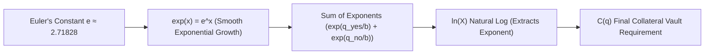

# Comprehensive LMSR Mathematical Specification & Deep Analytical Guide (`formula.md`)

---

## 1. Executive Overview & Mathematical Foundation

The **Logarithmic Market Scoring Rule (LMSR)**, invented by economist Robin Hanson, is the foundational Automated Market Maker (AMM) mechanism for prediction markets. 

Unlike traditional constant-product AMMs (e.g. Uniswap $x \cdot y = k$), LMSR is specifically engineered for **binary and categorical outcome markets** ($N \ge 2$). It provides:
1. **Infinite Liquidity:** Traders can always buy or sell any outcome quantity at a deterministic price.
2. **Bounded Financial Exposure:** The market maker's maximum worst-case loss is mathematically capped at $b \cdot \ln(N)$.
3. **Information Aggregation:** Spot prices naturally reflect the market's collective belief / probability distribution ($P(\text{YES}) + P(\text{NO}) = 1.0$).

---

## 2. Foundational Mathematical Building Blocks

### 2.1 The Constants & Functions

| Symbol | Mathematical Definition | Precise Role in LMSR Engine |
| :--- | :--- | :--- |
| **$e$** | Euler's Number ($\approx \mathbf{2.718281828459045...}$) | The natural base of logarithms. Chosen because $\frac{d}{dx}(e^x) = e^x$, eliminating extraneous scaling constants during derivative price calculations on-chain. |
| **$\ln(2)$** | Natural Logarithm of 2 ($\approx \mathbf{0.693147180559945...}$) | The constant multiplier for binary market initial funding and maximum bounded loss cap ($b \cdot \ln(2)$). |
| **$\exp(x)$** | Exponential Function ($e^x$) | Maps liabilities $q_i / b$ into positive real numbers. Ensures outcome probabilities are always non-negative. |
| **$\ln(X)$** | Natural Logarithm ($\log_e(X)$) | The inverse of $\exp(x)$, satisfying $\ln(e^x) = x$. Compresses exponential sums back into linear collateral space. |
| **$b$** | Liquidity Depth Parameter | Controls the price sensitivity / depth of the pool. Larger $b$ reduces price slippage for a given trade size. |
| **$q_i$** | Net Liability for Outcome $i$ | Cumulative outcome tokens sold by the pool minus tokens bought back. |

---

## 3. Formula 1: The LMSR Cost Function $C(q)$

### 3.1 Definition & Mathematical Formulation
The cost function $C(q)$ computes the **total collateral (in FKToken)** required in the pool's vault to back a given liability state $q = (q_1, q_2, \dots, q_N)$:

$$C(q) = b \cdot \ln \left( \sum_{i=1}^{N} \exp\left(\frac{q_i}{b}\right) \right)$$

For a **binary market** ($N = 2$, outcomes YES and NO with quantities $q_{\text{yes}}$ and $q_{\text{no}}$):

$$C(q_{\text{yes}}, q_{\text{no}}) = b \cdot \ln \left( \exp\left(\frac{q_{\text{yes}}}{b}\right) + \exp\left(\frac{q_{\text{no}}}{b}\right) \right)$$

### 3.2 Deep Theoretical Analysis: Why Log-Sum-Exp?
Mathematically, $b \cdot \ln(\sum \exp(q_i/b))$ is known as the **Soft-Maximum (Log-Sum-Exp)** function. As $b \to 0$, $C(q) \to \max(q_1, \dots, q_N)$. Because $b > 0$, the function provides a smooth, convex, infinitely differentiable upper bound over all outcome liabilities.

### 3.3 Worked Numerical Example 1: Pool Initialization ($q_{\text{yes}}=0, q_{\text{no}}=0$)
Let liquidity parameter $b = 1000\text{ FKToken}$.

1. **Calculate Exponent Arguments:**  
   $$\frac{q_{\text{yes}}}{b} = \frac{0}{1000} = 0 \quad \text{and} \quad \frac{q_{\text{no}}}{b} = \frac{0}{1000} = 0$$

2. **Evaluate Exponentials:**  
   $$\exp(0) = e^0 = 1.0 \quad \text{and} \quad \exp(0) = 1.0$$

3. **Sum Exponentials:**  
   $$\text{Sum} = 1.0 + 1.0 = 2.0$$

4. **Apply Natural Logarithm:**  
   $$\ln(2.0) \approx 0.69314718$$

5. **Multiply by Liquidity Parameter $b$:**  
   $$C(0, 0) = 1000 \cdot 0.69314718 = \mathbf{693.14718 \text{ FKToken}}$$

---

## 4. Formula 2: Trade Cost Execution $\Delta C$

### 4.1 Definition & Integral Derivation
When a trader executes a transaction altering liabilities from $q_{\text{old}}$ to $q_{\text{new}} = q_{\text{old}} + \Delta q$, the required net cost $\Delta C$ is the definite integral of the marginal price vector:

$$\Delta C = \int_{q_{\text{old}}}^{q_{\text{new}}} P(q) \, dq = C(q_{\text{new}}) - C(q_{\text{old}})$$

$$\Delta C = b \cdot \ln \left( \frac{\sum_{i=1}^N \exp\left(\frac{q_{i, \text{new}}}{b}\right)}{\sum_{i=1}^N \exp\left(\frac{q_{i, \text{old}}}{b}\right)} \right)$$

* **$\Delta C > 0$ (Buy Trade):** Trader deposits $\Delta C$ collateral tokens into the pool.
* **$\Delta C < 0$ (Sell Trade):** Pool pays $|\Delta C|$ collateral tokens to the trader.

### 4.2 Worked Numerical Example 2: Buying 200 YES Tokens
Given pool state: $b = 1000\text{ FKToken}$, initial liabilities $q_{\text{yes}}=0, q_{\text{no}}=0$.  
Trader buys $\Delta q_{\text{yes}} = 200$ tokens ($q_{\text{yes, new}} = 200, q_{\text{no, new}} = 0$).

1. **Calculate New Exponentials:**  
   $$\exp\left(\frac{200}{1000}\right) = \exp(0.2) = e^{0.2} \approx 1.221402758$$
   $$\exp\left(\frac{0}{1000}\right) = \exp(0) = 1.0$$

2. **Calculate New Sum & Cost:**  
   $$\text{Sum}_{\text{new}} = 1.221402758 + 1.0 = 2.221402758$$
   $$C(200, 0) = 1000 \cdot \ln(2.221402758) = 1000 \cdot 0.7981388 = \mathbf{798.1388 \text{ FKToken}}$$

3. **Compute Trade Cost $\Delta C$:**  
   $$\Delta C = C(200, 0) - C(0, 0) = 798.1388 - 693.1472 = \mathbf{104.9916 \text{ FKToken}}$$

> 💡 **Average Execution Price:** $\frac{104.9916}{200} = \mathbf{\$0.52495 \text{ per YES token}}$.

---

## 5. Formula 3: Marginal Spot Price $P(i)$ & Implied Probability

### 5.1 Derivative Proof
The spot price $P(i)$ for outcome $i$ represents the instantaneous cost for an infinitesimal share $dq_i$. It is derived by taking the partial derivative of $C(q)$ with respect to $q_i$:

$$P(i) = \frac{\partial C(q)}{\partial q_i} = \frac{b \cdot \frac{1}{\sum \exp(q_j/b)} \cdot \exp(q_i/b) \cdot \frac{1}{b}}{1} = \frac{\exp\left(\frac{q_i}{b}\right)}{\sum_{j=1}^{N} \exp\left(\frac{q_j}{b}\right)}$$

For a binary market ($N=2$):

$$P(\text{YES}) = \frac{\exp(q_{\text{yes}}/b)}{\exp(q_{\text{yes}}/b) + \exp(q_{\text{no}}/b)}$$

$$P(\text{NO}) = \frac{\exp(q_{\text{no}}/b)}{\exp(q_{\text{yes}}/b) + \exp(q_{\text{no}}/b)} = 1 - P(\text{YES})$$

### 5.2 Price Sensitivity & Slippage Rate
The derivative of spot price with respect to quantity $q_i$ defines the **instantaneous price impact (slippage rate)**:

$$\frac{d P(i)}{d q_i} = \frac{P(i) \cdot (1 - P(i))}{b}$$

* **Maximum Slippage:** Occurs when market is 50/50 ($P = 0.5$). Slippage rate $= \frac{0.25}{b}$.
* **Depth Control:** Doubling $b$ cuts price slippage exactly in half!

### 5.3 Worked Numerical Example 3: Spot Price Evolution
* **At $q_{\text{yes}}=0, q_{\text{no}}=0$ ($b=1000$):**  
  $$P(\text{YES}) = \frac{1.0}{1.0 + 1.0} = \mathbf{0.5000 \text{ (\$0.50 / 50.0\%)}}$$

* **After buying 200 YES tokens ($q_{\text{yes}}=200, q_{\text{no}}=0$):**  
  $$P(\text{YES}) = \frac{e^{0.2}}{e^{0.2} + 1.0} = \frac{1.2214}{2.2214} = \mathbf{0.5498 \text{ (\$0.5498 / 54.98\%)}}$$

### 5.4 Worked Scenario A: Balanced But Active Trading ($q_{\text{yes}} = 500, q_{\text{no}} = 500, b = 1000$)
When both outcomes have been purchased equally, the market is balanced but active:
1. **Exponent Arguments:**  
   $$\frac{q_{\text{yes}}}{b} = \frac{500}{1000} = 0.5 \quad \text{and} \quad \frac{q_{\text{no}}}{b} = \frac{500}{1000} = 0.5$$
2. **Evaluate Exponentials:**  
   $$\exp(0.5) = e^{0.5} \approx 1.648721 \quad \text{and} \quad \exp(0.5) \approx 1.648721$$
3. **New Cost $C(500, 500)$:**  
   $$\text{Sum} = 1.648721 + 1.648721 = 3.297442$$
   $$C(500, 500) = 1000 \cdot \ln(3.297442) \approx 1000 \cdot 1.193147 = \mathbf{1193.147 \text{ FKToken}}$$
4. **Evaluate Prices:**  
   $$P(\text{YES}) = \frac{1.648721}{3.297442} = \mathbf{0.5000 \text{ (50.0\%)}}$$
   *Insight:* Since quantities sold are identical, the spot price is exactly $0.50$, even though the pool holds $500$ of both outcome tokens.

### 5.5 Worked Scenario B: Asymmetric / Heavily Bought Market ($q_{\text{yes}} = 800, q_{\text{no}} = 200, b = 1000$)
When traders are heavily biased towards YES:
1. **Exponent Arguments:**  
   $$\frac{q_{\text{yes}}}{b} = \frac{800}{1000} = 0.8 \quad \text{and} \quad \frac{q_{\text{no}}}{b} = \frac{200}{1000} = 0.2$$
2. **Evaluate Exponentials:**  
   $$\exp(0.8) \approx 2.225541 \quad \text{and} \quad \exp(0.2) \approx 1.221403$$
3. **New Cost $C(800, 200)$:**  
   $$\text{Sum} = 2.225541 + 1.221403 = 3.446944$$
   $$C(800, 200) = 1000 \cdot \ln(3.446944) \approx 1000 \cdot 1.237493 = \mathbf{1237.493 \text{ FKToken}}$$
4. **Evaluate Prices:**  
   $$P(\text{YES}) = \frac{2.225541}{3.446944} \approx \mathbf{0.6457 \text{ (64.57\%)}}$$
   $$P(\text{NO}) = \frac{1.221403}{3.446944} \approx \mathbf{0.3543 \text{ (35.43\%)}}$$
   *Insight:* The price of YES has risen to $\$0.6457$ while NO has fallen to $\$0.3543$.

### 5.6 Worked Scenario C: Selling Shares Back to the Pool (Negative Cost Delta)
Suppose Alice holds YES shares and decides to sell $200$ YES tokens back to the pool when the pool is in the state $q_{\text{yes}} = 800, q_{\text{no}} = 200$ (Scenario B).  
The pool's YES liabilities will drop to $q_{\text{yes, new}} = 600$, while NO remains $q_{\text{no, new}} = 200$.

1. **Calculate New Cost state $C(600, 200)$:**  
   $$\exp(0.6) \approx 1.822119 \quad \text{and} \quad \exp(0.2) \approx 1.221403$$
   $$\text{Sum} = 1.822119 + 1.221403 = 3.043522$$
   $$C(600, 200) = 1000 \cdot \ln(3.043522) \approx 1000 \cdot 1.113017 = \mathbf{1113.017 \text{ FKToken}}$$
2. **Compute Cost Difference $\Delta C$:**  
   $$\Delta C = C(600, 200) - C(800, 200) = 1113.017 - 1237.493 = \mathbf{-124.476 \text{ FKToken}}$$
   *Insight:* The negative cost ($\Delta C < 0$) indicates that the pool **pays out** $124.476\text{ FKToken}$ to the seller. The seller gets an average rate of $\approx \$0.62238$ per share sold.

---

## 6. Formula 4: Maximum Bounded Loss Cap

### 6.1 Theoretical Proof of Bounded Loss
Suppose outcome YES wins at resolution. The pool must pay out $1.0\text{ FKToken}$ for every YES token sold ($q_{\text{yes}}$).  
The pool's net profit/loss is the total revenue collected minus payouts:

$$\text{Net P&L} = C(q_{\text{yes}}, 0) - C(0, 0) - q_{\text{yes}}$$

Taking the limit as $q_{\text{yes}} \to \infty$:

$$\lim_{q_{\text{yes}} \to \infty} \left[ b \cdot \ln\left(e^{q_{\text{yes}}/b} + 1\right) - q_{\text{yes}} \right] = b \cdot \ln(1) = 0$$

$$\text{Worst-Case Loss} = 0 - C(0, 0) = -b \cdot \ln(2)$$

$$\text{Max Loss Cap} = b \cdot \ln(2) \approx \mathbf{0.693147 \cdot b}$$

---

## 7. Formula 5: Trading Fees & LP Fee Accumulator Math

### 7.1 Gross Fee Collection
Trading fee rate $\gamma$ (e.g. 2% $= 0.02 \times 10^{18}$) is charged on gross trade cost $|\Delta C|$:

$$\text{Fee Amount} = \frac{|\Delta C| \cdot \gamma}{10^{18}}$$

### 7.2 Synthetix-Style Cumulative Fee Accumulator
To prevent $O(N)$ iteration over stakers, global accumulated fee per share $accFeePerShare$ is updated on every trade:

$$\Delta accFeePerShare = \frac{\text{Fee Amount} \cdot \text{lpRewardRatio}}{\text{totalLPTokenSupply}}$$

$$accFeePerShare_{\text{new}} = accFeePerShare_{\text{old}} + \Delta accFeePerShare$$

### 7.3 Staker Claim Calculation
For a staker with balance $L_u = \text{lpTokenBalanceOf}[u]$ and snapshot $S_u = \text{userFeePerSharePaid}[u]$:

$$\text{Pending Reward} = \frac{L_u \cdot (accFeePerShare - S_u)}{10^{18}}$$

---

## 8. Fixed-Point Mathematics in Solidity EVM (`Fixed192x64Math`)

Because Ethereum EVM lacks native floating-point support, all calculations in `LMSRMarketMaker.sol` utilize **192.64 Fixed-Point Precision** (192 integer bits, 64 fractional bits):

$$\text{Fixed-Point Scaling Factor (ONE)} = 2^{64} = 18446744073709551616$$

$$\ln(2) \text{ in 192.64 Format} = 12786308645202655660$$

Exponentials are computed using binary powers ($2^x$) via the identity:

$$\exp(x) = e^x = 2^{x \cdot \log_2(e)} = 2^{x / \ln(2)}$$

This guarantees **sub-ppm accuracy** and zero floating-point non-determinism across EVM nodes.

---

## 9. Comprehensive Reference Summary

| Equation Name | Exact Mathematical Formula | EVM Implementation Reference |
| :--- | :--- | :--- |
| **LMSR Cost $C(q)$** | $b \cdot \ln \left( \sum \exp(q_i / b) \right)$ | `calcNetCost()` using `Fixed192x64Math.binaryLog` |
| **Trade Cost $\Delta C$** | $C(q_{\text{new}}) - C(q_{\text{old}})$ | `trade()` execution collateral delta |
| **Spot Price $P(i)$** | $\frac{\exp(q_i / b)}{\sum \exp(q_j / b)}$ | `calcMarginalPrice()` view function |
| **Max Loss Cap** | $b \cdot \ln(2)$ | Initial seed funding requirement |
| **Slippage Rate** | $\frac{P(i)(1 - P(i))}{b}$ | Price impact per share $dq$ |
| **LP Fee Accumulator** | $\frac{\text{Fee} \cdot \text{lpRatio}}{\text{totalLPSupply}}$ | `accFeePerShare` state update |
